= Mule Migration Assistant Tutorial
ifndef::env-site,env-github[]
include::_attributes[]
endif::[]

This tutorial walks you through the main steps for migrating a Mule 3 app to
Mule 4. It covers use of the MMA, the Migration report, and the Compatibility
module.

[[prereqs]]
== Prerequisites

In addition to using the MMA, which initiates the
migration to Mule 4, you also need to use two versions of Anypoint Studio.
Studio 6 is compatible with Mule 3.x runtime versions. Studio 7 is compatible
with Mule 4.x runtimes.

* MMA: https://repository.mulesoft.org/nexus/service/local/repositories/releases/content/com/mulesoft/tools/mule-migration-assistant-runner/1.0.0/mule-migration-assistant-runner-1.0.0.zip[Mule Migration Assistant (Zip file)]
* https://www.mulesoft.com/lp/dl/studio/previous[Anypoint Studio 6 (external link)]
* https://www.mulesoft.com/lp/dl/studio[Anypoint Studio 7 (external link)]: The minimum requirement is version 7.3.0.

This tutorial uses Studio version 6.6.4 for the Mule 3 app and Studio 7.5.0 for
the migrated Mule 4 app.

[[step_1]]
== Step 1: Download and Import a Mule 3 App

Start by downloading a Mule 3 app from Anypoint Exchange, then importing it
into Studio 6. In subsequent sections, you will migrate this app to Mule 4.

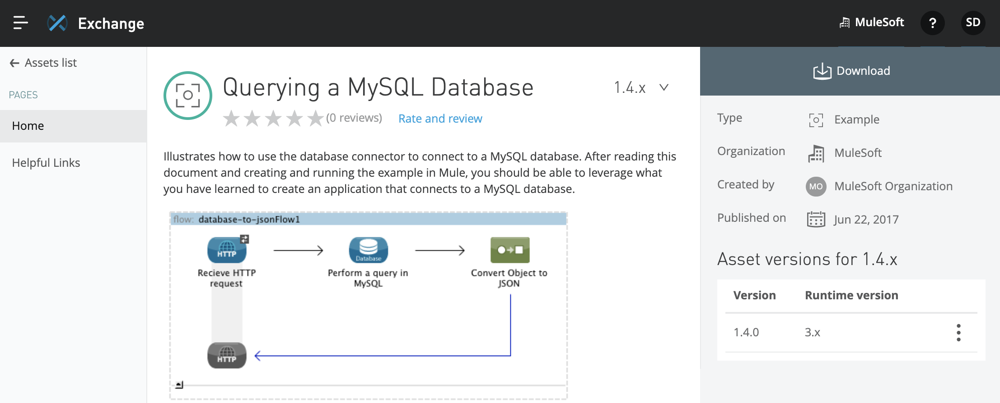

. Download version 1.4.0 of the https://anypoint.mulesoft.com/exchange/org.mule.examples/querying-a-mysql-database/1.4.0/[Querying a MySQL Database (external link)]
asset from Exchange.
+
Note that the 1.4.0 asset is a Mule 3 app that runs on Mule Runtime 3.x. Its
filename is `querying-a-mysql-database-1.4.0-mule-application-example.zip`.
. In Studio 6, import the downloaded zip file by going to *File* -> *Import* ->
*Anypoint Studio generated Deployable Archive (zip)*, navigating
to the zip file, and then clicking *Finish*.
+
This process loads the app into a project in Studio 6. By default, the name of
the project matches the zip filename (minus the file extension).
+
. Proceed to <<step_2>>.

[[step_2]]
== Step 2: Create a Mule 4 App from the Mule 3 App

Run MMA on the Mule 3 app. In subsequent sections, you will import the migrated app into Studio 7 and perform the manual steps needed to complete the migration to Mule 4.

. Unzip MMA `mule-migration-assistant-runner-1.0.0.zip` file that you downloaded
in <<prereqs>>.
+
The Zip file contains `mule-migration-assistant-runner-1.0.0.jar` and a `/libs`
subdirectory with a number of MMA-related JAR files that provide MMA resources.
+
. In a command console, run MMA from the directory unzipped directory, and set
`-projectBasePath` and `-destinationProjectBasePath` options.
+
.Example:
[source,console,linenums]
----
$ java -jar mule-migration-assistant-runner-1.0.0.jar -muleVersion 4.3.0 -projectBasePath /Users/me/AnypointStudio/workspace-studio6/querying-a-mysql-database-1.4.0-mule-application-example -destinationProjectBasePath /Users/me/Downloads/querying-a-mysql-database-mule4
----
+
Note that you must _revise the directory paths_ in the command line example above
to specify your local directories.
+
To discover the `-projectBasePath` to the Studio 6 project, you can navigate
to *File* -> *Switch Workspace* -> *Other* in Studio. To that path, you also
need to append the name of the project, as shown in the example above. The
`-destinationProjectBasePath` can be any local path. For details, see
xref:migration-tool-procedure.adoc#options[Command-line Options].
+
//WORKAROUND
.Windows only:
Note that if you are on a Windows machine and receive the message
`Exception: Cannot read mule project.`, try using forward slashes (`/`)
for paths set in the `projectBasePath` and `destinationProjectBasePath`
options. You should also try running the command through a standard Windows
console.
+
When MMA runs successfully, the console output looks something like this:
+
[souce,console,linenums]
----
$ ...
Executing migrator 1.0.0...
===============================================================================
MIGRATION ASSISTANT RUN SUCCESSFULLY
===============================================================================
Total time: 9.405 s
Migration report: /Users/me/Downloads/querying-a-mysql-database-mule4/report/summary.html
----
+
. Proceed to <<step_3>>

[[step_3]]
== Step 3: Import the Migrated App to Studio 7

Import the migrated app into Studio 7. In subsequent steps, you will perform the manual procedure needed to complete the migration to Mule 4

. In Studio 7, import the generated Mule 4 app as a Studio project:
.. Navigate to *File* -> *Import* -> *Anypoint Studio/Anypoint Studio project from File System*.
.. Load the *Project Root* directory that contains the Mule 4 app.
.. Click *Open*.
. Open the imported app in Studio 7.
+
The app is in the *querying-a-mysql-database-mule4* project. All the app's components are in a single flow called *database-to-jsonFlow*.
+
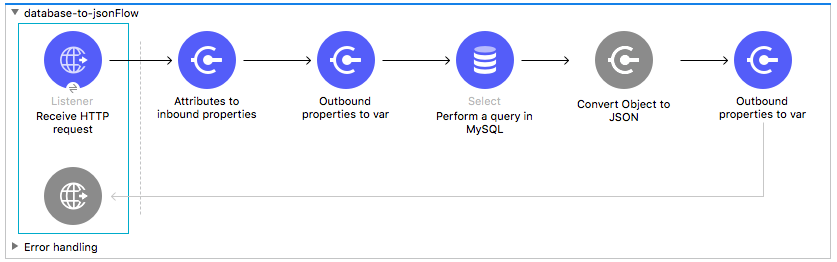
+
. Proceed to <<step_4>>

[[step_4]]
== Step 4: Perform Manual Migration Procedures

Open and review the MMA-generated xref:migration-report.adoc[Mule Migration report],
fix the issues it finds, and remove any unnecessary complexity that MMA adds to
the app.

A migration report identifies items that remain to complete the migration to
Mule 4. For the sample app, the migration report looks like this:

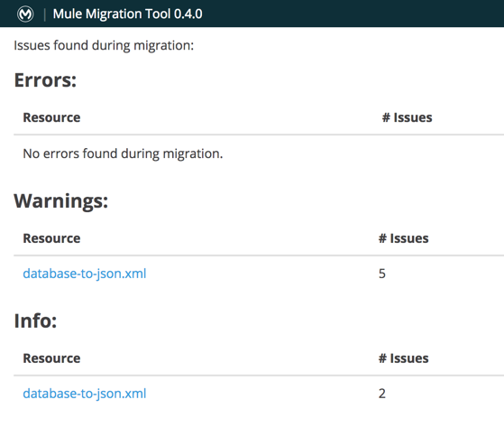

The warnings (WARN messages) in this report are associated with
components in the
xref:migration-tool.adoc#compatibility_module[Compatibility module] that you
need to migrate manually before using the app in a production environment.
A report can also contain errors (ERROR messages) that must be migrated manually
before the app will work and INFO messages about Mule 3 components that were
replaced by Mule 4 improvements or removed.

. In a web browser, open the Migration report (`summary.html`) produced by the
MMA.
+
You can find the path to the report at the bottom of the MMA's console output,
for example:
`/Users/me/Downloads/querying-a-mysql-database-mule4/report/summary.html`.
+
. Address warnings and other messages in the report by performing these tasks:
+
//FROM REPORT
* <<warning_1>>
* <<warning_2>>
* <<warning_3>>
* <<warning_4>>
* <<warning_5>>
* <<warning_6>>
* <<warning_7>>

When you complete the modifications, the flow will look like this:

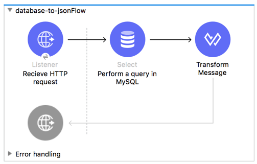

[[warning_1]]
=== Migrate HTTP Listener Components

In Mule 3, connectors and transports that send outbound data must explicitly specify outbound properties, such as outgoing status code responses
or headers for an HTTP listener.

The Migration report produces this warning twice within the *HTTP listener*
component:

//FROM REPORT
[source,txt,linenums]
----
Migration WARN:
Avoid using an outbound property to determine the status code.
----

Because the Mule 3 sample app does not use the `statusCode` outbound property
from the Mule 3 HTTP transport and because no outbound property is set in a
flow, you can safely remove any use of the outbound property in this case.

. In Studio 7, delete these elements from the Configuration XML for the
migrated app:
+
[source,xml,linenums]
----
<http:response statusCode="#[migration::HttpListener::httpListenerResponseSuccessStatusCode(vars)]">
  <!--Migration WARN: Avoid using an outbound property to determine the status code.-->
  <!--    For more information refer to:-->
  <!--        * https://github.com/mulesoft/mule-migration-assistant/blob/master/docs/user-docs/migration-tool-post-mig.adoc#outbound_properties-->
  <http:headers>#[migration::HttpListener::httpListenerResponseHeaders(vars)]</http:headers>
</http:response>
<http:error-response statusCode="#[vars.statusCode default migration::HttpListener::httpListenerResponseErrorStatusCode(vars)]">
  <!--Migration WARN: Avoid using an outbound property to determine the status code.-->
  <!--    For more information refer to:-->
  <!--        * https://github.com/mulesoft/mule-migration-assistant/blob/master/docs/user-docs/migration-tool-post-mig.adoc#outbound_properties-->
  <http:headers>#[migration::HttpListener::httpListenerResponseHeaders(vars)]</http:headers>
</http:response>
----
+
. Notice that MMA provided an HTTP Listener configuration above the `<flow/>`
element in the XML configuration:
+
[source,xml,linenums]
----
<http:listener-config doc:name="HTTP Listener Configuration"
  name="HTTP_Listener_Configuration">
    <http:listener-connection host="localhost" port="${http.port}" />
</http:listener-config>
----
+
You can define the property placeholder for the port in your project or (see
https://docs.mulesoft.com/mule-runtime/4.3/mule-app-properties-to-configure.html[Configure Property Placeholders], an external link)
or use a port number (for example, `port="8080"`).
+
. Proceed to <<warning_2>>.

[[warning_2]]
=== Migrate the Attributes to Inbound Properties Component

This component reads attributes of the Mule message and generates a Mule 3.x
equivalent of inbound properties as a variable. Any use of an Inbound property
in a migrated app requires you to replace references to an Inbound property
with the Attributes object from the new Mule message.

Because there are no inbound properties in the `querying-a-mysql-database-1.4.0-mule-application-example` app, you can safely
remove the *Inbound Properties Component* component from it.

The Migration report produces this warning for the
*Attributes to Inbound Properties* component:

[source,txt,linenums]
----

Migration WARN:
Expressions that query 'inboundProperties' from the message should instead
query the message 'attributes'. Remove this component if there are no uses of
'inboundProperties' in expressions or components that rely on
'inboundProperties' (such as 'copy-properties').-->
----

. Delete the *Attributes to Inbound Properties* component:
+
[source,XML,linenums]
----
<compatibility:attributes-to-inbound-properties>
  <!--Migration WARN: Expressions that query 'inboundProperties' from the
  message should instead query the message 'attributes'. Remove this
  component if there are no uses of 'inboundProperties' in expressions or
  components that rely on 'inboundProperties' (such as 'copy-properties').-->
    <!--    For more information refer to:-->
    <!--
    https://docs.mulesoft.com/mule-runtime/4.3/intro-mule-message#inbound-properties-are-now-attributes-->
</compatibility:attributes-to-inbound-properties>
----
+
. Proceed to <<warning_3>>.

[[warning_3]]
=== Migrate Outbound Properties to var Component

The migration report produces this warning for the two
*Outbound Properties to var* components in the flow:

[source,txt,linenums]
----

Migration WARN:
Instead of using outbound properties in the flow, move the expression that
sets the property into the XML attribute (such as 'method') of the operation
or listener that accepts the expression.
----

The XML element for the *Outbound Properties to var* component looks like this:

[source,XML,linenums]
----
<compatibility:outbound-properties-to-var>
    <!--Migration WARN: Instead of using outbound properties in the flow,
      move the expression that sets the property into the XML attribute (such
      as 'method') of the operation or listener that accepts the
      expression.-->
    <!--    For more information refer to:-->
    <!--
    https://github.com/mulesoft/mule-migration-assistant/blob/master/docs/user-docs/migration-tool-post-mig.adoc#outbound_properties-->
</compatibility:outbound-properties-to-var>
----

. To understand this issue, double-click the *Outbound Properties to var* icon
in the *Message Flow* view, and go to the *Help* tab in the configuration area.
+
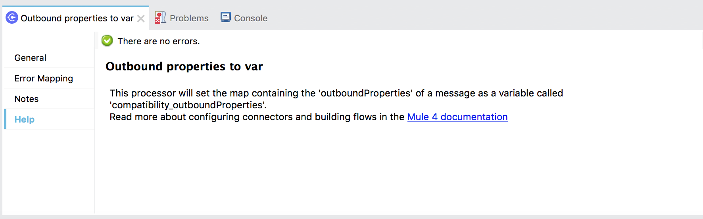
+
This note indicates that the component is intended to emulate the use of
outbound properties in a Mule 3 App. Because there are no outbound properties
in the flow, it is safe to remove the components.
. Remove the both *Outbound Properties to var* components
(`<compatibility:outbound-properties-to-var />` elements) from the app.
. Proceed to <<warning_4>>.

[[warning_4]]
=== Migrate the Global Database Connection

The Migration report produces this information about the global connector
configuration element within *Perform a query in MySQL* component:

[source,txt,linenums]
----

Migration INFO:
The config in Mule 3 is specific for an engine, but it contained an 'url'
attribute. It will be made generic in order to keep the URL.
----

MMA sets the global connector configuration to a *Generic* type
to preserve the `url` attribute used in the Mule 3 app. However, because
the app is using a MySQL database, you can change the global connection type
and its settings to a *MySQL Connection*.

. Double-click the *Perform a query in MySQL* component to open its
configuration tab.
. In the *General* tab, click the green plus sign (*&#43;*) located to the right of the *Connector configuration* text field. (If you mouse over the *&#43;*, you see the word *Add*.)
+
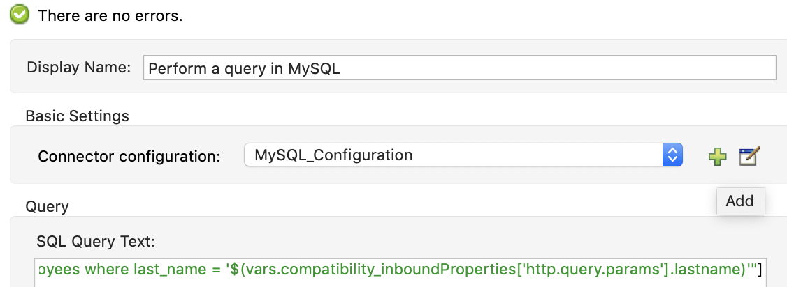
+
. In the *Database Config* window that opens, click the *Connection* field, and change the value from *Generic Connection* to *MySQL Connection*.
+
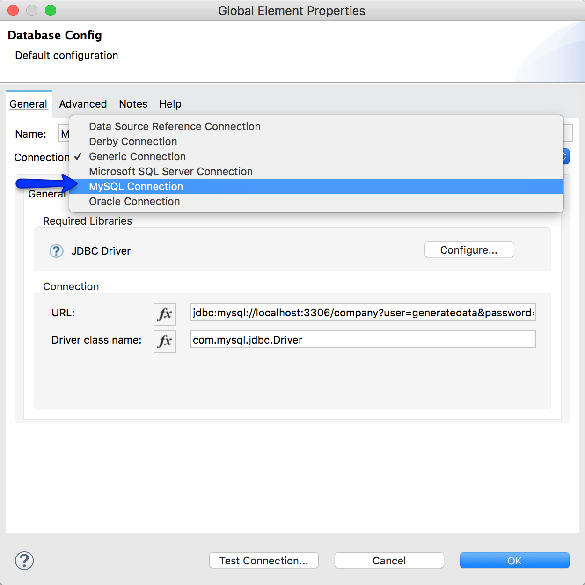
+
. To add the recommended JDBC driver for this database, click the *Configure*
button and select *Add recommended library* to replace any existing driver.
+
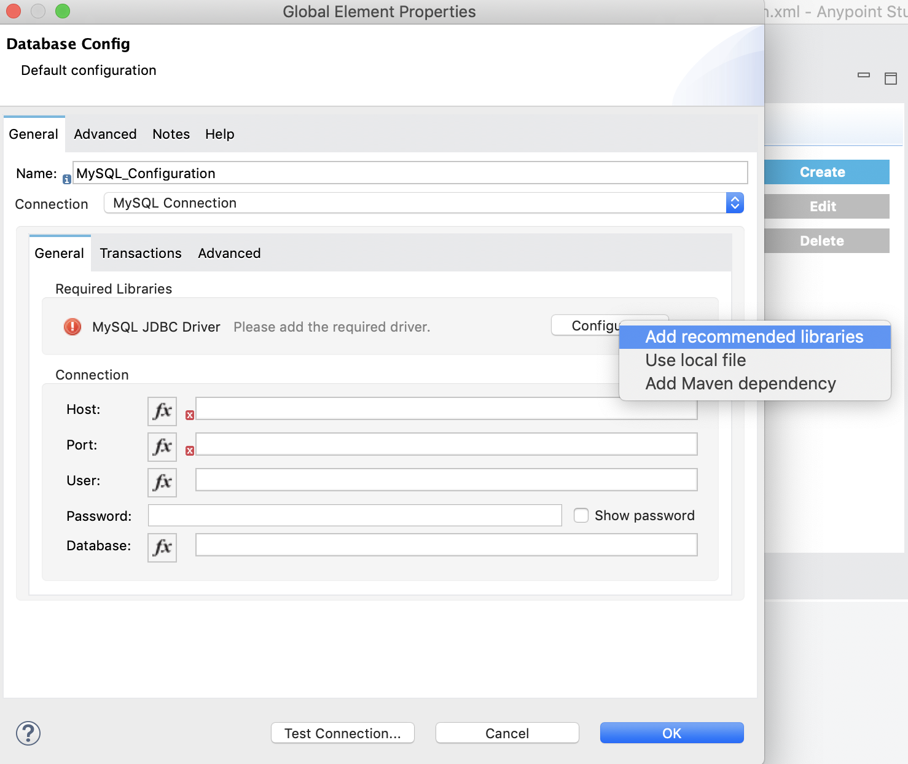
+
. If you have access to a MySQL server into which you can import a database, specify your *Connection* settings, and use `company` for the *Database*
setting, for example:
+
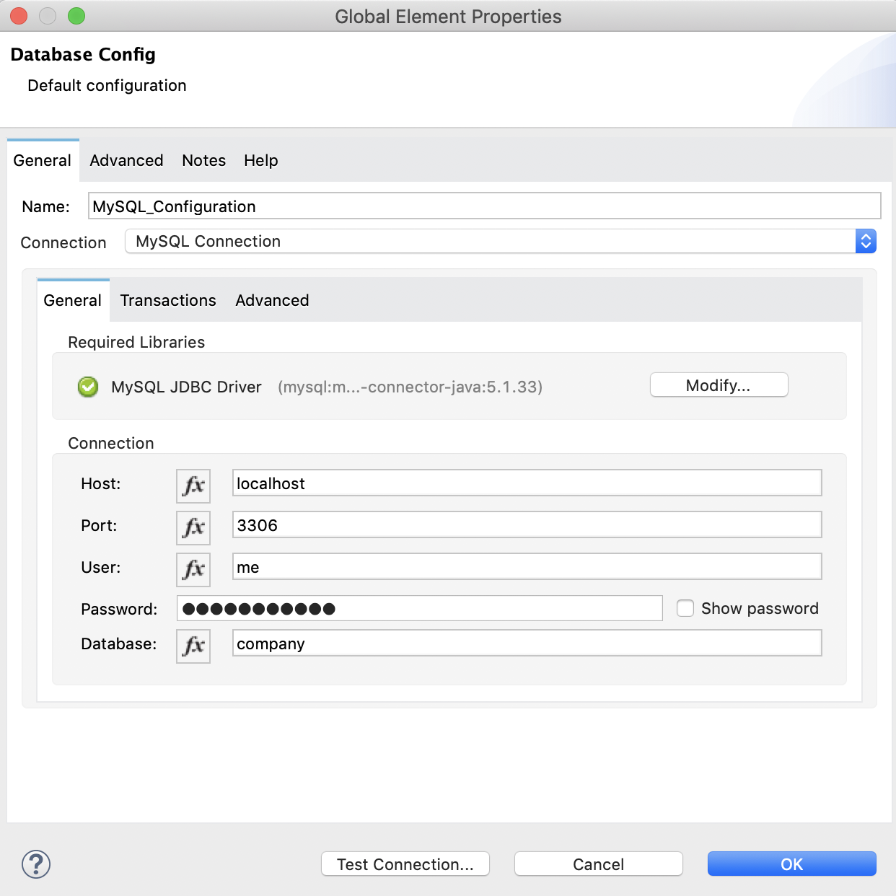
+
You can skip this step if you do not have access to a MySQL database server.
+
. Proceed to <<warning_5>>, also for the *Perform a query in MySQL* component.

[[warning_5]]
=== Migrate the Database Query to Mule 4

The Migration report produces this warning regarding `inboundProperties`
settings within *Perform a query in MySQL* component:

[source,txt,linenums]
----

Migration WARN:
Expressions that query inboundProperties from the message should instead query
the attributes of the message. Remove this component when there are no
remaining usages of inboundProperties in expressions or components that rely
on inboundProperties (such as 'copy-properties').
----

In this procedure, you replace the reference to the inbound property with a
parameter called `:lastname`, then define a `lastName` input parameter as a
reference to `attributes.queryParams.lastName`.

. In the *General* tab of the *Perform a query in MySQL*, delete the _value_ of
`last_name` in the Mule 3 SQL *Query*:
+
[source,sql,linenums]
----

#["select first_name from employees where last_name = '$(vars.compatibility_inboundProperties['http.query.params'].lastname)'"]
----
+
. Replace the deleted value of `last_name` with a parameter called `:lastname`:
+
[source,sql,linenums]
----
SELECT first_name FROM employees WHERE last_name = :lastName
----
+
Be sure to _remove_ the hash mark and square brackets (`#[]`).
+
. On the *Input Parameters* field, click the *fx* button, and specify the following in the text field:
+
[source,sql,linenums]
----

{'lastName' : attributes.queryParams.lastname}
----
+
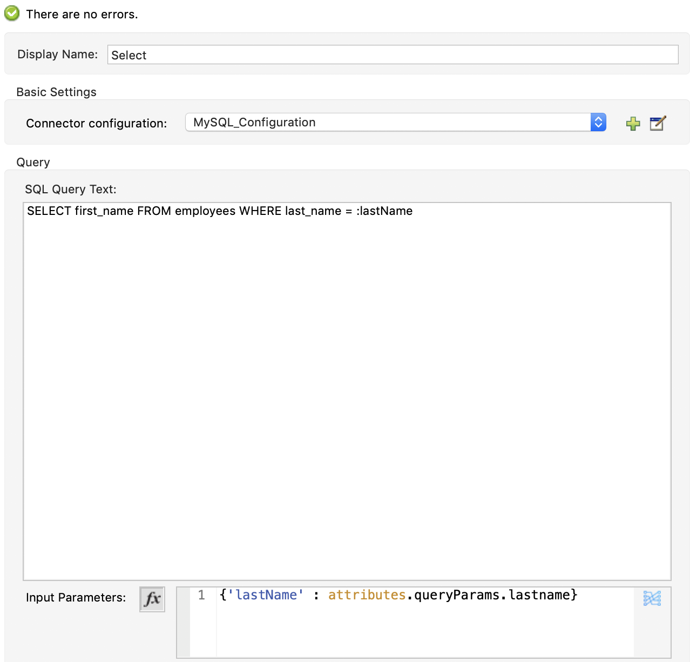
+
. Proceed to <<warning_6>>, also for the *Perform a query in MySQL* component.

[[warning_6]]
=== Review the Message on Streaming in Mule 4

Mule 4 handles streaming differently than Mule 3, so the Migration report
produces this message in the *Perform a query in MySQL* component:

[source,txt,linenums]
----

Streaming is enabled by default in Mule 4
----

. Simply review the
xref:migration-connectors-database.adoc#database_streaming[Enabling Streaming]
documentation.
+
You do not need to perform any manual migration tasks in this case.
+
. Proceed to <<warning_7>>.

[[warning_7]]
=== Replace the Convert Object to JSON Component

MMA does not support the migration of the *Object to JSON* component to Mule 4.

To complete the migration, this procedure replaces the *Convert Object to JSON*
transformer with a *Transform Message* component, sets the output type of the
DataWeave script in the *Transform Message* component to JSON, and sets the
script to the message `payload`.

. Delete the *Convert Object to JSON* transformer from the flow.
+
`<json:object-to-json-transformer doc:name="Convert Object to JSON" />`
+
. In the Mule Palette, click *Core*, then locate and drag the
*Transform Message* component to the same location in the flow.
. Double-click the *Transform Message* component to open the configuration area.
. In the *Output* section on the right, replace `application/java` and the
curly braces (`{}`) with `application/json` and `payload`, like this:
+
[source,dataweave,linenums]
----

%dw 2.0
output application/json
---
payload
----
+
The configuration should look like this:
+
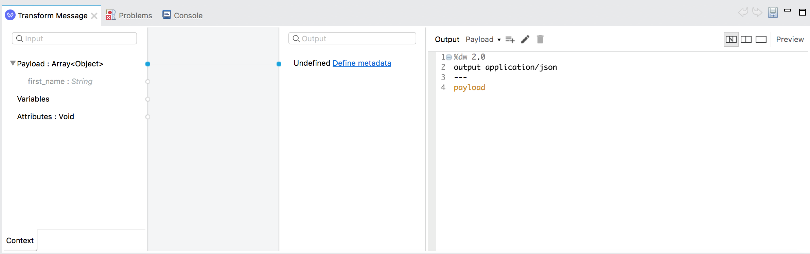
+
. Go to the Configuration XML view in Studio to verify that there are no
remaining comments that contain WARN messages.
. By the end of the migration, the flow should look like this:
+

+
. Proceed to <<test_app>>.

[[test_app]]
== Step 5: Run and Test the Migrated App

After completing all the manual migration steps for the app, you can run and
test that it works.

.Prerequisites:
To be able to test the migrated app, you need a MySQL server into which you can
import and query the `employees` database, and you need working database and
HTTP listener connections.

. Run this script into your MySQL server:
link:../attachments/create.sample.db.sql[Sample MySQL Script]
+
This script creates a database called `company` with an `employees` table that
contains data needed to test the SELECT query defined in <<warning_5>>.
One way to import the script is through the *Data Import/Restore* area of the
MySQL Workbench too using the *Import from Self-Contained File* field to point
to the script.
+
For example, after logging into your MySQL server on a Mac (for example, with `mysql --user=root -p`), you might run this command to run the script:
`mysql> source /usr/local/mysql/bin/create.sample.db.sql`
+
. In Studio, test your *Connection* to the MySQL database.
+
You test the connection from dialog that opens when you click to edit the
*Connector config* in the *Perform a query in MySQL* component.
+
Make sure the connection is successful before proceeding to the next step.
+
. Now test your *Connection* to the HTTP listener from the
*Receive HTTP request* component.
+
Make sure the connection is successful before proceeding to the next step.
+
. Make sure your app is running in Studio.
+
You can right-click the canvas in Studio and select *Run project* to run the app.
+
You need to check the *Console* in Studio to make sure the app deploys
successfully before proceeding to the next step.
+
. In a web browser or app such as Postman, go to URL (such as
  `+http://localhost:8080/?lastname=Howard+`) that uses your HTTP listener
  configuration, and view the JSON results:
+
[source,json,linenums]
----

[
  {
      "first_name": "Devin"
  },
  {
      "first_name": "Luke"
  }
]
----
+
Notice that the URL includes query parameters defined in the HTTP listener
configuration.

Note that you can also download and import the Mule 4 version of
https://anypoint.mulesoft.com/exchange/org.mule.examples/querying-a-mysql-database/2.1.4/[Querying a MySQL Database app for Mule 4 (external link)] from Exchange and compare your results.

== See Also

* xref:migration-tool.adoc[Migration to Mule 4]
* https://docs.mulesoft.com/studio/7.5/import-export-packages[Importing and Exporting Projects (external link)]
* xref:../migration-intro.adoc[Migration to Mule 4]
